# Single-Cell Transcriptomic Profiling and Systems Biology of Glioblastoma

**Author:** Abhishek S R

**Domain:** Bioinformatics, Cancer Genomics, Single-Cell RNA-seq  

## Project Overview

This repository hosts a comprehensive, end-to-end bioinformatics pipeline for the high-resolution single-cell RNA sequencing (scRNA-seq) analysis of human Glioblastoma Multiforme (GBM). The dataset encompasses 5,604 high-fidelity cells profiled via the 10x Genomics Chromium platform (3' v3 chemistry) from a 57-year-old male donor. Sequenced on an Illumina NovaSeq 6000 at a depth of 44,736 reads per cell—yielding a median of 3,094 detected genes and 9,434 UMIs per cell—the data provides the requisite transcriptional depth for rigorous systems biology applications.

The analytical framework is designed to systematically deconstruct intra-tumoral heterogeneity, delineate the complex architecture of the tumor microenvironment (TME), and infer tumor-intrinsic oncogenic drivers, signaling interactomes, and transcriptional master regulators.

## Pipeline Architecture & Analytical Findings

The pipeline is programmatically implemented in R, utilizing Seurat v5 as the foundational framework, synergized with advanced systems biology algorithms. The repository is structured sequentially within the `R/` directory. Resultant analytical visualizations are archived in `results/plots/`.

### Phase 1: Pre-processing & Core Analytics

**1. Quality Control & Quality Assurance (`01_load_data_qc.R`)**
* **Analytical Rationale:** To mitigate technical artifacts, including ambient RNA, empty droplets, and apoptotic or stressed cells, thereby ensuring the retention of high-fidelity transcriptomic profiles for downstream manifold learning.
* **Algorithmic Implementation:** `Seurat v5`.
* **Results & Interpretation:** Cells were subjected to rigorous filtering based on total UMI counts, unique feature detection rates, and mitochondrial transcript fraction. This stringent QC protocol yielded a robust dataset of 5,604 viable cells, effectively minimizing technical noise.
* **Visualizations:**
* 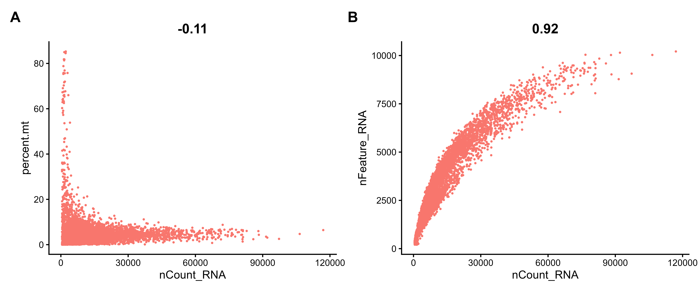
  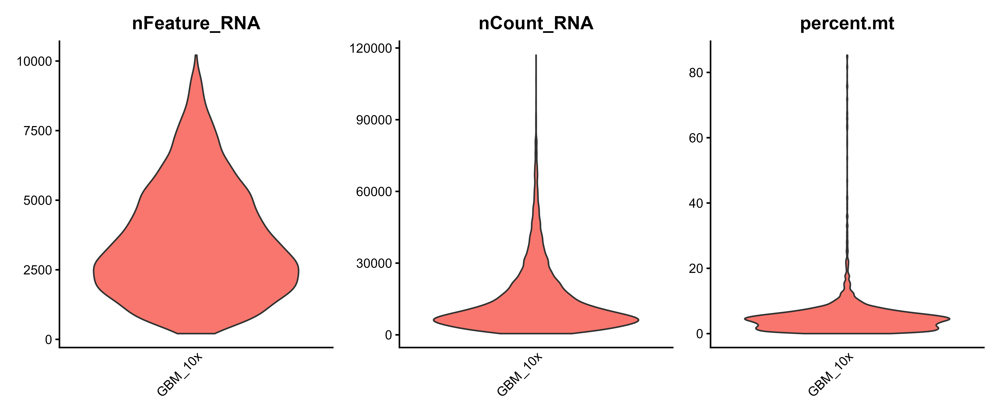

**2. Variance Stabilization & Feature Selection (`02_normalization_feature_selection.R`)**
* **Analytical Rationale:** To normalize transcript counts, regress out technical covariates (e.g., sequencing depth), and empirically select highly variable genes (HVGs) that encompass the core biological variance of the sample.
* **Algorithmic Implementation:** `Seurat v5` (SCTransform).
* **Results & Interpretation:** The SCTransform framework successfully stabilized technical variance. The defined subset of HVGs provided a highly informative feature space for optimal downstream dimensionality reduction and clustering.
* **Visualizations:** 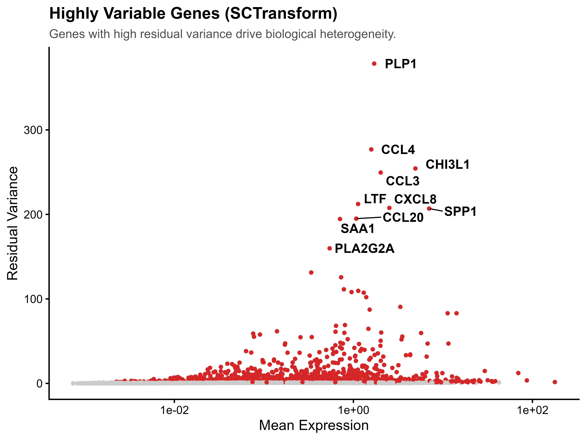

**3. Dimensionality Reduction & Manifold Learning (`03_dimensionality_reduction.R`)**
* **Analytical Rationale:** To project high-dimensional transcriptomic spaces into computationally tractable, lower-dimensional manifolds, facilitating the visual resolution of distinct cellular topographies.
* **Algorithmic Implementation:** `Seurat v5` (PCA, UMAP, t-SNE).
* **Results & Interpretation:** Principal Component Analysis (PCA) captured the primary axes of variance, which subsequently anchored non-linear graph-based embeddings (UMAP and t-SNE), accurately reconstructing the spatial relationships of transcriptionally analogous cell states.
* **Visualizations:**
* 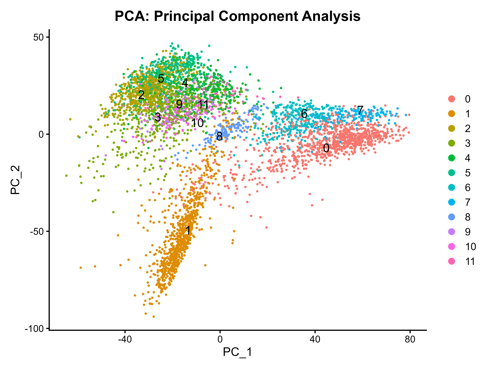
  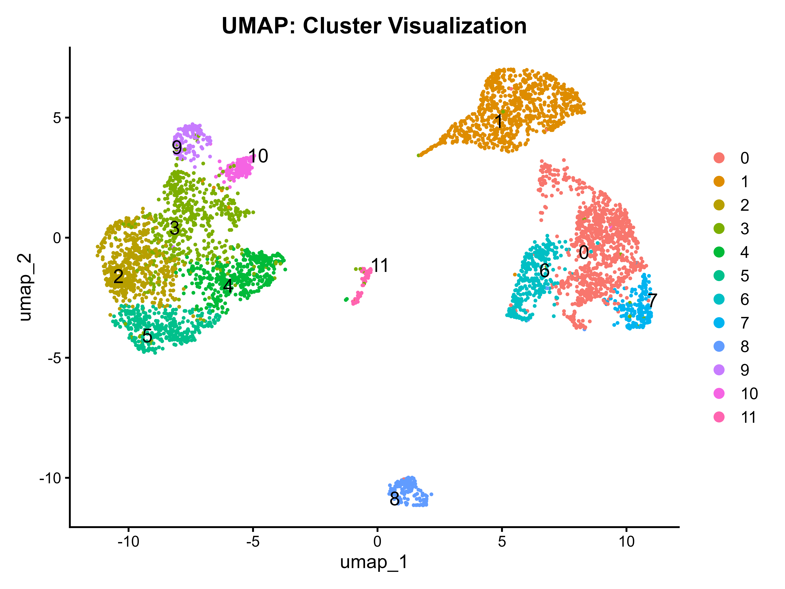

**4. Graph-Based Clustering & Phenotypic Annotation (`04_clustering.R`, `05_annotation.R`)**
* **Analytical Rationale:** To empirically resolve the TME into discrete phenotypic compartments and assign robust biological identities utilizing established canonical marker signatures.
* **Algorithmic Implementation:** `Seurat v5` (Shared Nearest Neighbor [SNN] graph construction, Louvain algorithm).
* **Results & Interpretation:** The analysis characterized a prototypical GBM ecosystem characterized by a dominant, malignant astroglial-like lineage embedded within a profound myeloid infiltrate. The cellular census resolved as: **Astrocytes** (1,921 cells, 41.08%), **Tumor cells** (1,885 cells, 40.31%), **Microglia/Macrophages** (476 cells, 10.18%), **OPCs** (252 cells, 5.39%), and **T cells** (142 cells, 3.04%).
* **Visualizations:**
* 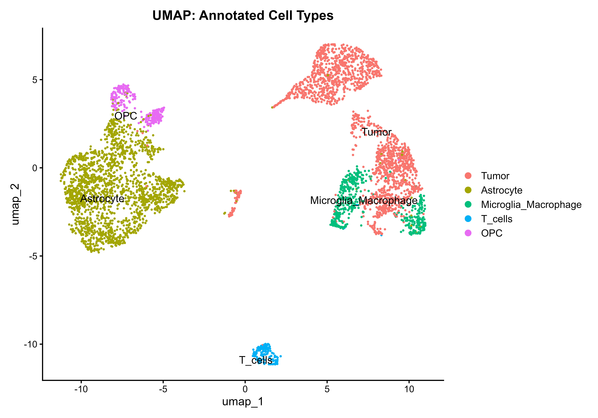
  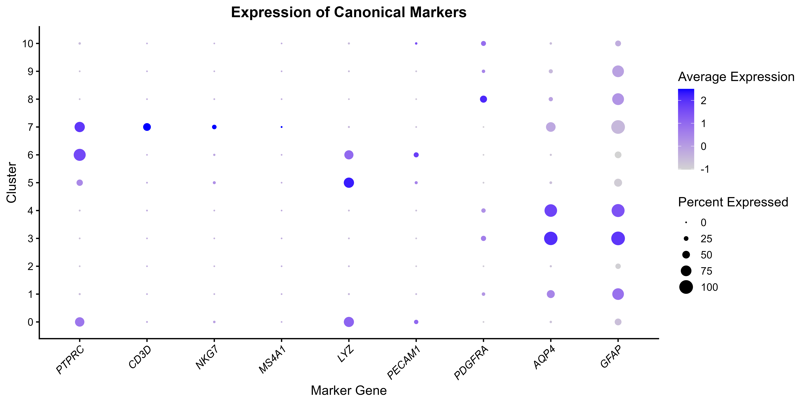

### Phase 2: Differential Expression & Functional Enrichment

**5. Differential Gene Expression (DGE) Analysis (`06_differential_expression.R`)**
* **Analytical Rationale:** To isolate tumor-intrinsic oncogenic transcriptomes by contrasting the malignant compartment against an analogous reference population (astrocytes), thereby extracting robust disease-specific signatures.
* **Algorithmic Implementation:** `Seurat v5` (Wilcoxon Rank Sum test).
* **Results & Interpretation:** DGE profiling successfully delineated tumor-upregulated genes, which encompass critical candidate oncogenes, proliferation markers, and stemness regulators. Conversely, tumor-downregulated genes mapped to the suppression of canonical glial homeostatic programs during malignant transformation.
* **Visualizations:**
* 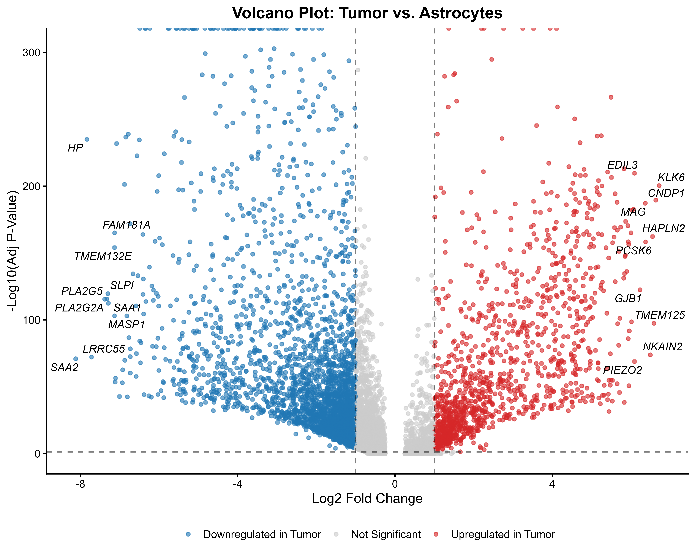
  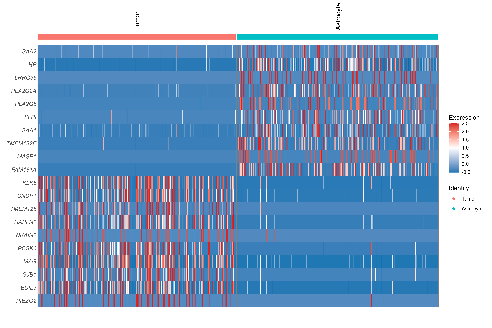

**6. Gene Set Enrichment Analysis & Pathway Topology (`07_pathway_enrichment.R`)**
* **Analytical Rationale:** To project differential transcriptional signatures onto curated biological networks, elucidating the functional consequences and targetable therapeutic vulnerabilities of the tumor state.
* **Algorithmic Implementation:** `clusterProfiler`, `org.Hs.eg.db`, `enrichplot`.
* **Results & Interpretation:** Gene Ontology (GO) profiling revealed a massive upregulation in functional modules driving cell cycle progression, DNA replication, and mitotic spindle dynamics—hallmarks of highly proliferative GBM. Concordant KEGG pathway analysis mapped these signatures to established oncogenic signaling circuits.
* **Visualizations:**
* 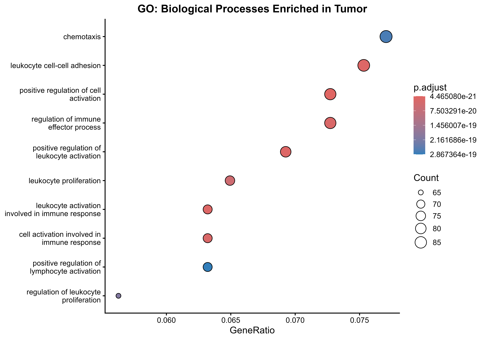
  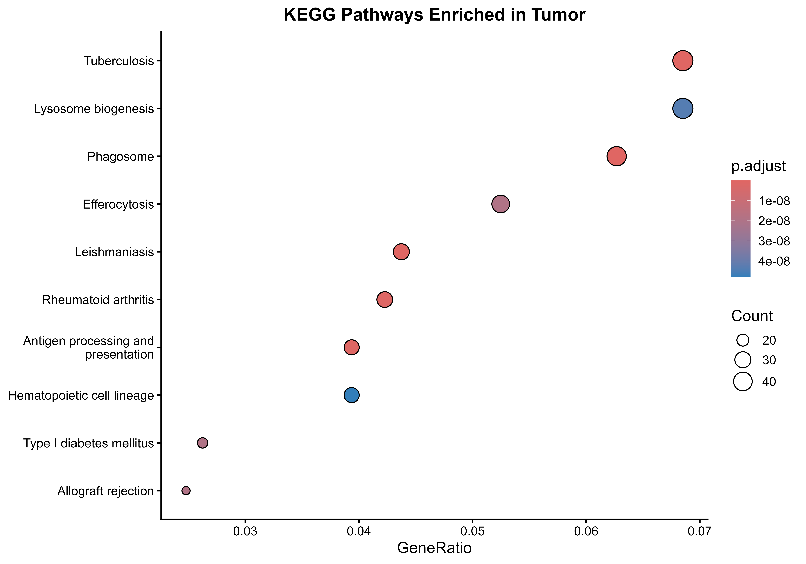

### Phase 3: Advanced Systems Biology & Tumor Heterogeneity

**7. Sub-clonal Architecture & Cell Cycle Phase Scoring (`08_tumor_specific_analysis.R`)**
* **Analytical Rationale:** To dissect the intra-tumoral heterogeneity (ITH) of the malignant compartment, resolving functionally distinct sub-clones based on cell cycle dynamics and specific transcriptional states.
* **Algorithmic Implementation:** `Seurat v5` (Cell Cycle Scoring).
* **Results & Interpretation:** Exclusive reclustering of the tumor subset, integrated with S and G2/M phase scoring, isolated highly proliferative clones from quiescent subpopulations. This sub-stratification provides a high-resolution framework for linking specific malignant states to niche microenvironments.
* **Visualizations:**
* 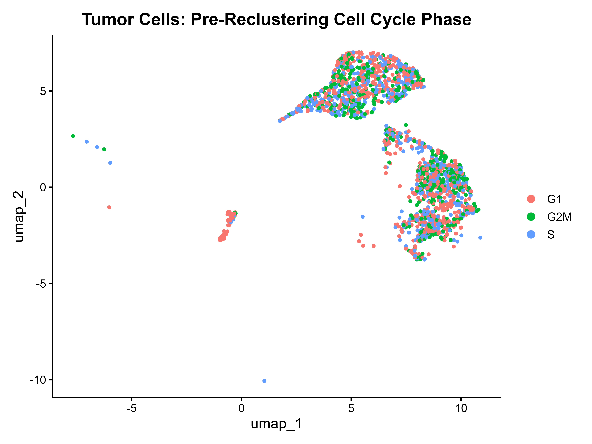
  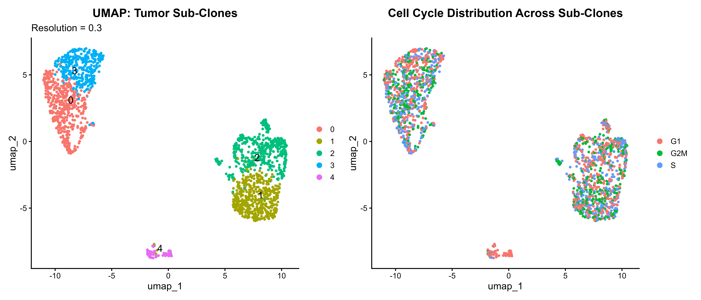

**8. Ligand-Receptor Interactome Modeling (`09_cell_cell_communication.R`)**
* **Analytical Rationale:** To computationally infer the intercellular signaling network within the TME, elucidating the molecular crosstalk between the malignant clone and the stromal/immune infiltrates.
* **Algorithmic Implementation:** `CellChat`.
* **Results & Interpretation:** Interactome mapping identified dense signaling hubs primarily mediated by growth factors, cytokines, and immunosuppressive axes. The model highlights specific pathways hijacked by the tumor to modulate macrophage polarization and suppress T-cell efficacy.
* **Visualizations:**
* 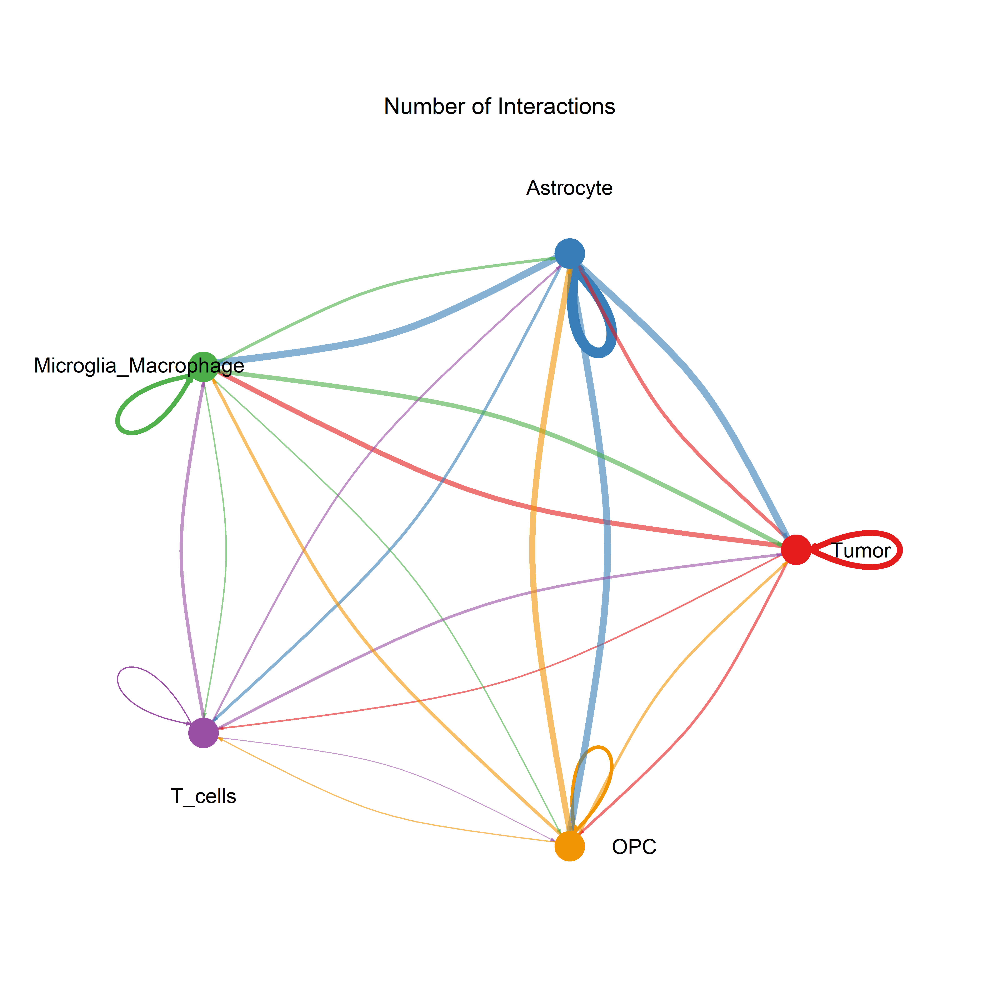
  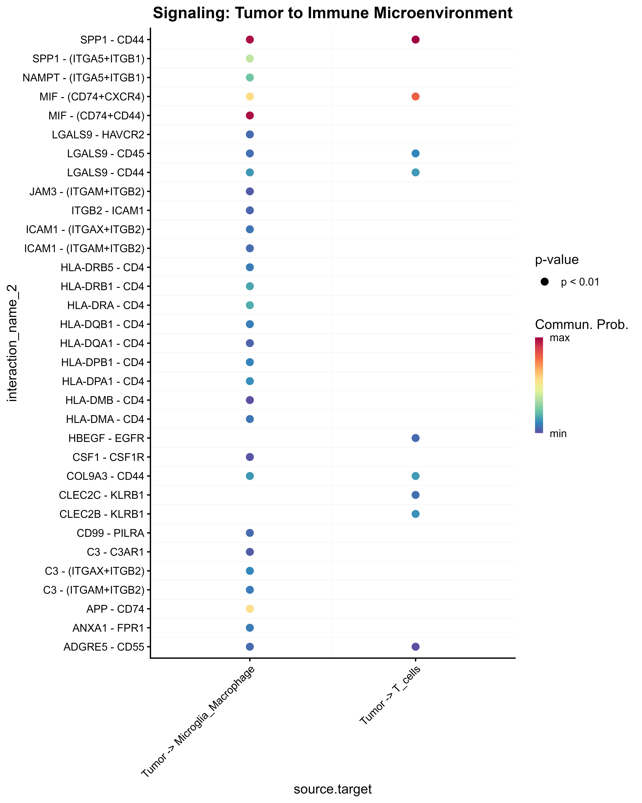

**9. Pseudotemporal Trajectory Inference (`10_pseudotime.R`)**
* **Analytical Rationale:** To computationally reconstruct the evolutionary or phenotypic lineage of tumor cells, mapping the continuum of cellular state transitions across the malignant manifold.
* **Algorithmic Implementation:** `slingshot`, `SingleCellExperiment`.
* **Results & Interpretation:** Pseudotime mapping successfully arrayed tumor sub-clones along inferred developmental trajectories, effectively differentiating putative ancestral (stem-like/early) states from more differentiated or adapted (late) states, providing insights into GBM plasticity.
* **Visualizations:** 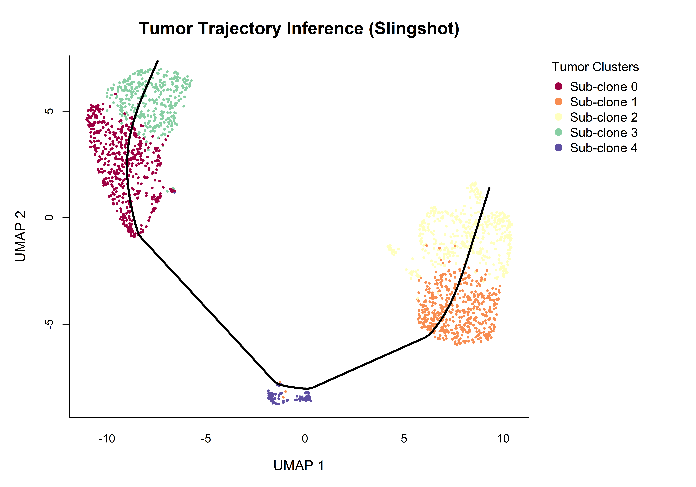

**10. Master Regulator & Transcription Factor Regulon Activity (`11_Transcription_factor_activity.R`)**
* **Analytical Rationale:** To shift from transcript abundance to functional regulatory activity by inferring the activity scores of Transcription Factors (TFs) based on the expression of their downstream regulons.
* **Algorithmic Implementation:** `DoRothEA`, `viper`.
* **Results & Interpretation:** Regulon analysis pinpointed highly aberrant TF activity driving the GBM phenotype. The identified master regulators serve as primary mechanistic nodes orchestrating the oncogenic cascade, representing high-priority candidates for targeted perturbation strategies.
* **Visualizations:** 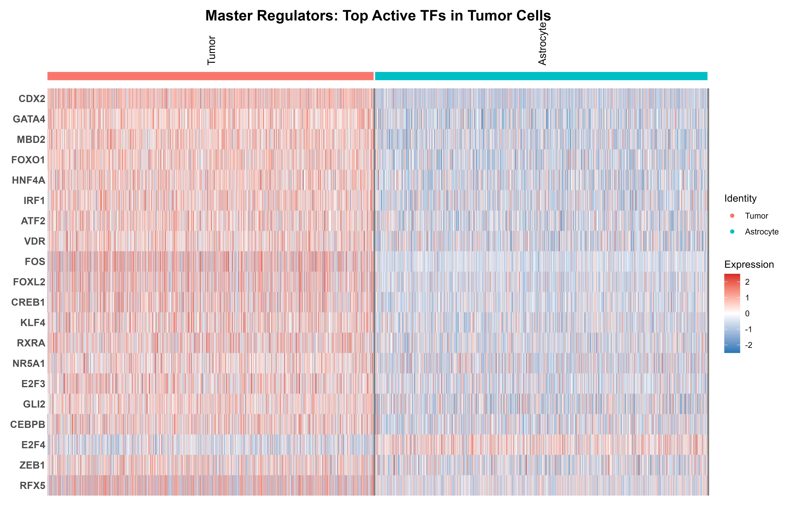

## Installation and Execution Protocol

1. Clone the repository to your local environment:
   ```bash
   git clone [https://github.com/](https://github.com/)<Abhishek-MSBI>/Single-Cell-Transcriptomic-Profiling-and-Systems-Biology-of-Glioblastoma.git
   cd Single-Cell-Transcriptomic-Profiling-and-Systems-Biology-of-Glioblastoma
